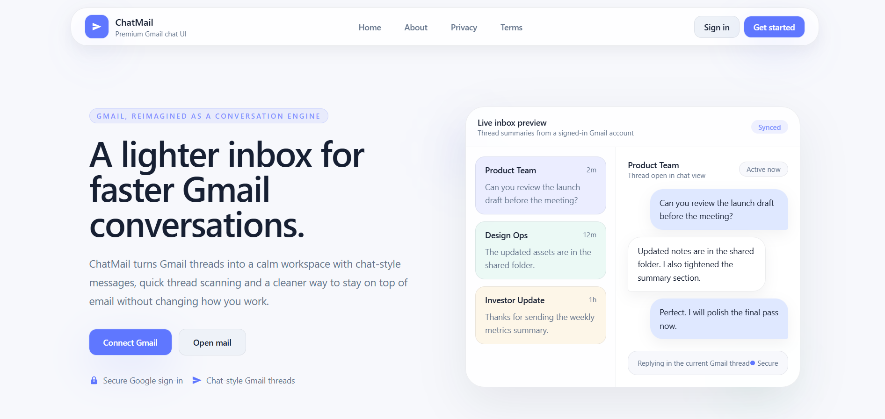
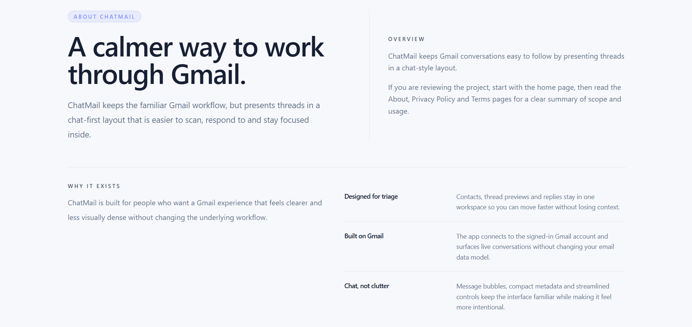
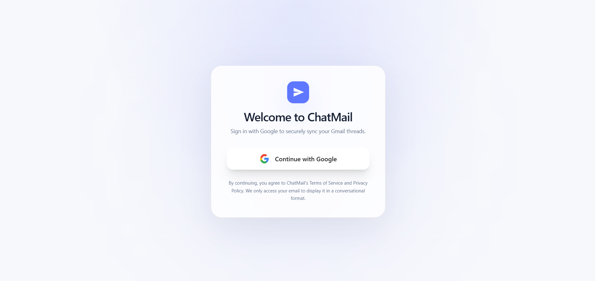
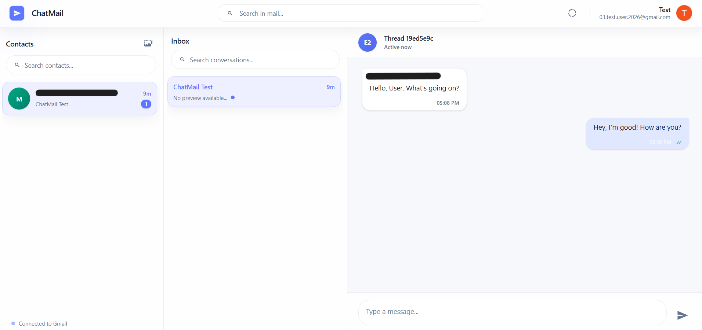
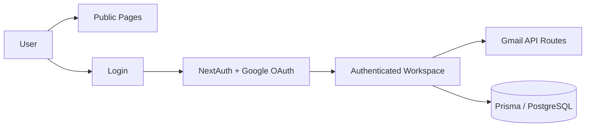

# ChatMail

ChatMail is a full-stack Gmail client that presents email conversations in a chat-style interface. It keeps Gmail at the center while making threads easier to scan, reply to and follow in a calmer layout.

## Overview

ChatMail uses Google OAuth for sign-in, Gmail API routes for mail access and a Next.js App Router frontend for the public pages and authenticated workspace.

The repository is organized around two clear flows:

- Public pages for Home, About, Privacy Policy, Terms of Service and Login
- Authenticated mail workspace for contacts, inbox threads and chat-style replies

## Features

- Chat-style rendering of Gmail threads
- Google OAuth sign-in
- Contacts and conversation lists for quick triage
- Thread reply flow powered by Gmail API routes
- Responsive layout for mobile, tablet and desktop
- Sanitized message rendering with DOMPurify
- Public informational pages for About, Privacy Policy and Terms of Service

## Screenshots

The screenshot set below reflects the current public pages and inbox workspace.

### Homepage

### About

### Login

### Inbox

Screenshot captures are included in the `screenshots` folder for reference.

## Tech Stack

- Next.js 15
- React 18
- TypeScript
- Tailwind CSS 4
- NextAuth.js with Google OAuth
- Gmail API
- Prisma
- PostgreSQL
- DOMPurify

## Architecture

## Repository Structure

- `src/app` - App Router pages and API routes
- `src/components` - Shared UI components
- `src/lib` - Auth and Gmail helpers
- `prisma` - Database schema and migrations
- `public` - Static assets
- `screenshots` - Repository screenshots

## Challenges & Learning

- Keeping the public pages and the inbox workspace visually consistent without changing product behavior
- Balancing Gmail-style density with a lighter presentation for portfolio use
- Managing Google OAuth and Gmail scopes while keeping the implementation focused on approved test-user access
- Structuring the app so the public pages and authenticated workspace remain separate and maintainable

## Known Limitations

- Gmail API functionality is currently limited to approved Google test users while Google verification is pending
- The mail workspace requires a signed-in Gmail account
- Screenshot captures are limited to public pages and the inbox workspace

## Security

- Google OAuth is used for authentication
- Gmail access is scoped through the Google account the user signs into
- Message content is sanitized before rendering in the UI
- Sensitive values are kept in environment variables and not exposed in the client

## Future Enhancements

- Full Google verification for broader Gmail API access
- Improved search and filtering inside the inbox workspace
- Compose and draft improvements
- Better loading and empty-state feedback across the workspace
- Additional polish for public pages and small screen layouts

## Notes

- The public pages are available without authentication.
- The inbox workspace is available only after sign-in.
